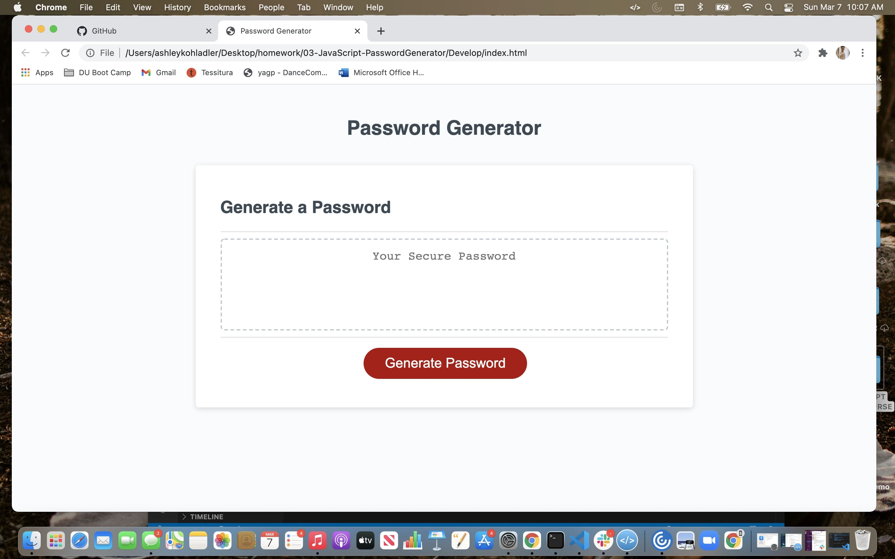

# 03-JavaScritpt-PasswordGenerator

# Homework 3

## Description of my work 

**JavaScript**

* I defined my variables.

* I created a function to generate password.

* I created an if statement to define length of password to be between 8-128 characters.

* I define a variable for which characters are allowed.

* I created a function to write the password.

* Added an event listener to generate button.

## Link to Website

## Screenshot
